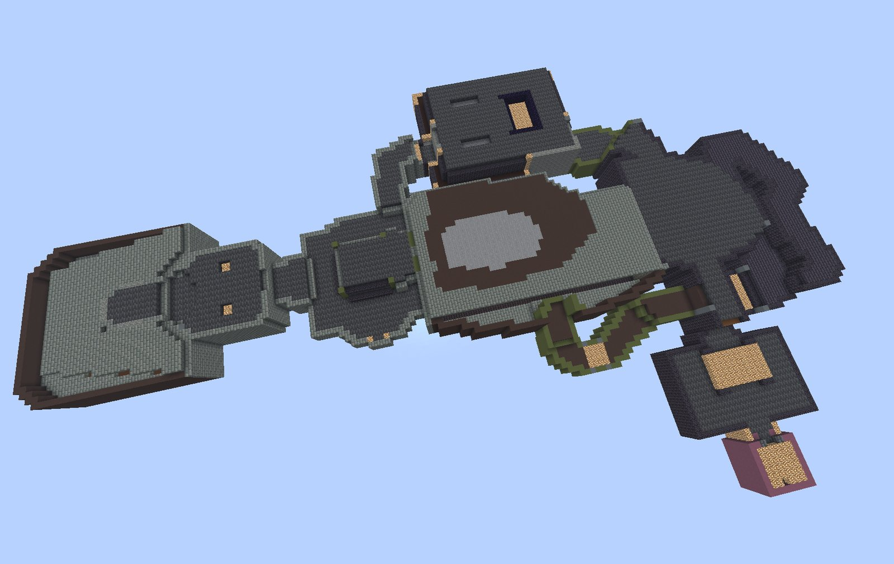
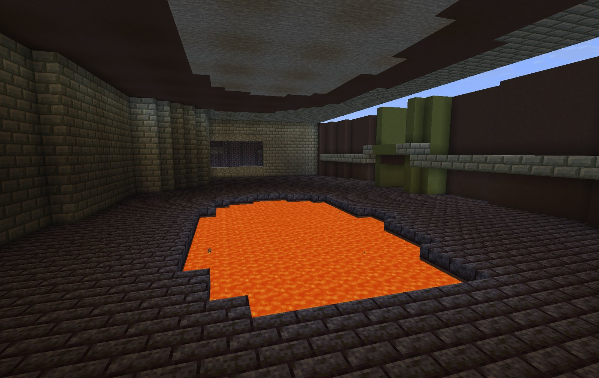
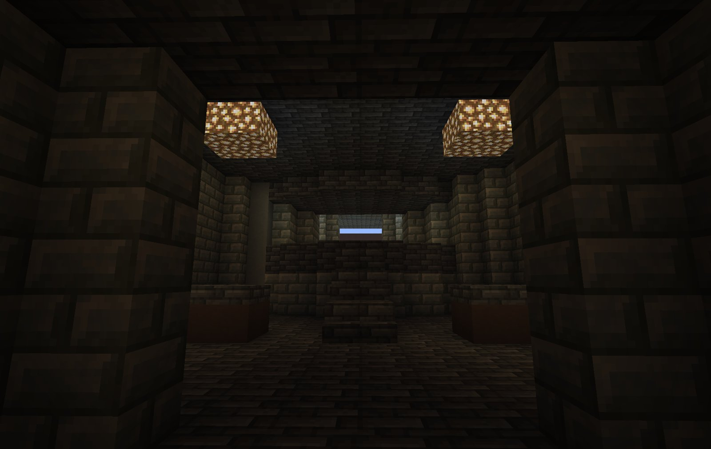
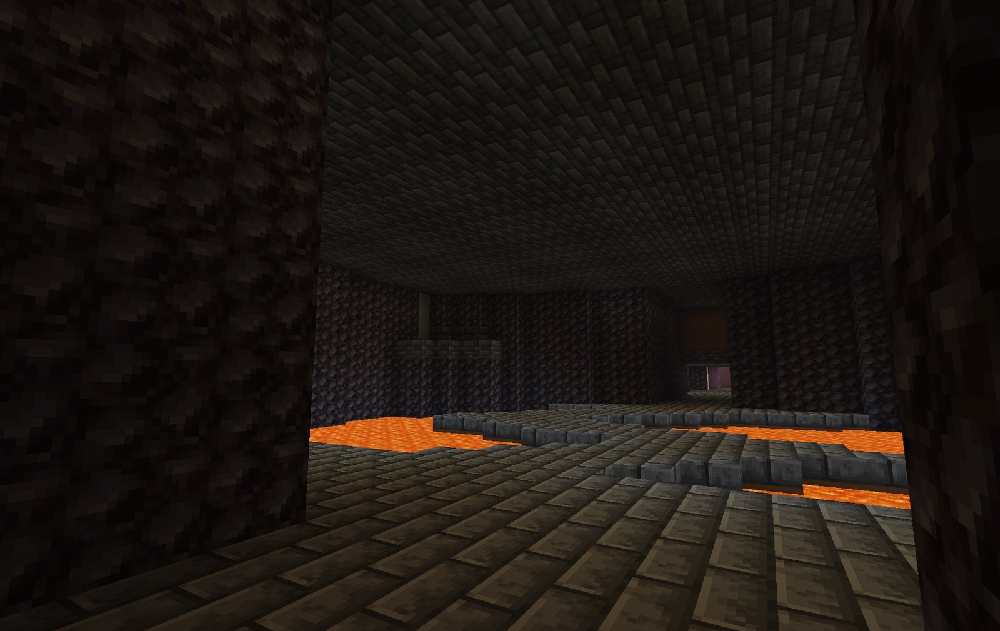
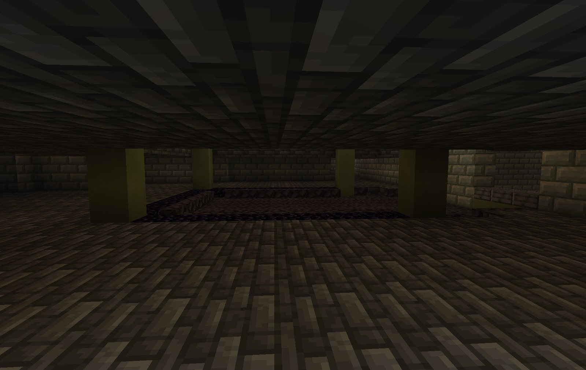
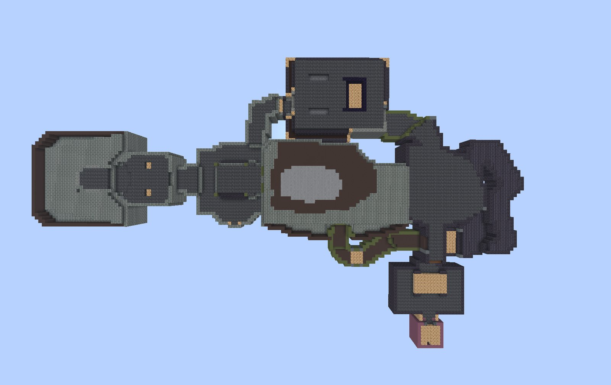
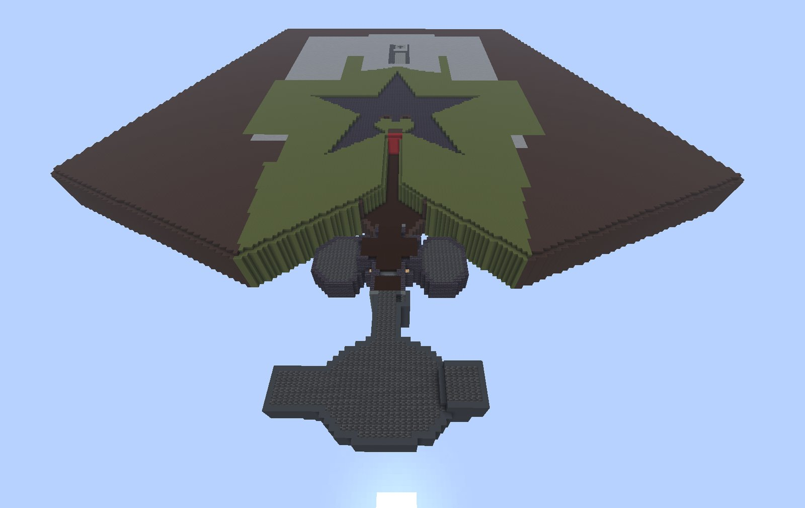

# WadCraft


Build Doom maps as Minecraft structures. Put a WAD file on your server, type one
command, and walk into E1M1.

A NeoForge mod for Minecraft 1.21.11. **Server-side only**: it places ordinary
blocks, so players with an unmodded client see everything it builds.

## Using it

Drop `.wad` files into the server's `wads/` folder (created on first start), then:

| Command | What it does |
|---|---|
| `/wadcraft list` | the WAD files in the folder |
| `/wadcraft maps <wad>` | the maps in one; click a map to build it |
| `/wadcraft info <wad> <map> [scale]` | how big it will be, before you build |
| `/wadcraft build <wad> <map> [here\|look] [scale]` | build it |
| `/wadcraft undo` | put back what your last build replaced |
| `/wadcraft cancel` | stop builds in progress |

`here` (the default) puts you on the map's player 1 start, facing the way Doom
faces you. `look` puts that start on the block you are looking at. Either way
the map turns to face your direction, to the nearest quarter turn.

`scale` is Doom units per block. The default, 32, makes a Doom player about the
height of a Minecraft one; 16 builds everything twice the size.

All commands need operator permission (level 2).

## What you get

- **The level's shape**: every sector's floor and ceiling height, walls sealed
  all round. Rooms with sky above them are open to the sky.
- **Colours from the WAD itself.** Each wall texture and flat is matched to the
  Minecraft block nearest its average colour, read from the WAD's own palette
  and graphics, so any WAD builds in roughly the right colours with no table to
  write. Override any texture in `config/wadcraft/blocks.json` (`*` is a
  wildcard). Lava is magma, and light panels glow.
- **Doors open**, so the level can be walked.
- **Steps you can walk up.** Floors are worked out in half blocks: a half step
  is a slab, and a half step beside a floor half a block higher is a stair
  facing up it, so Doom's staircases climb without jumping.
- **Toxic floors are lava.** Anywhere Doom hurts you for standing (nukage,
  slime) is lava, in pools with solid ground under and around them. Where lava
  could run onto a lower floor, it is magma instead. Both blocks can be changed
  in `blocks.json` (`hazard_floor`, `hazard_floor_spill`).
- **Lifts have ladders.** Doom stores a lift raised; it is built that way, with
  a ladder up its face from the floor below.
- **Walkable where Doom is.** Every opening a Doom player can walk through is
  checked to have room for a Minecraft player, and walls thinner than a block
  are built a block thick rather than lost.
- **Outdoor areas are walled up to the sky**, where Doom would have painted sky
  above a low wall.
- **Nothing in a build can burn.** The automatic palette has no flammable
  blocks, because a lava pool beside a wooden floor would take the whole level
  down. An override can still choose wood.
- **The level's lighting**, as invisible light blocks at each sector's brightness.
- Builds are placed a slice per tick, so a big map does not freeze the server.

- **Windows, lintels and thin walls survive.** Anything Doom draws thinner than
  a block is built a block thick rather than lost.

Not yet: monsters and items, moving doors and lifts (lifts get ladders), UDMF (text-format) maps.

## WAD files and licences

WadCraft contains no Doom data and ships none. **Freedoom**
(https://freedoom.github.io) is free and can be shared. The commercial Doom
WADs work, but they are not yours to give away: keep them on your own server.
A PWAD (a custom map) with no textures of its own takes its colours from an IWAD
in the same folder.

## For mod developers

Everything is in `com.sablednah.wadcraft.api.WadCraftApi`:

```java
WadFile wad = WadCraftApi.read(WadCraftApi.wadFolder().resolve("freedoom1.wad"));
int turns = WadCraftApi.turnsToFace(wad, "E1M1", player.getYRot());
WadCraftApi.build(level, wad, "E1M1", pos, turns, BuildOptions.defaults())
        .thenAccept(result -> player.sendSystemMessage(Component.literal("Built " + result.placed())));
```

`WadCraftApi.read(label, bytes)` reads a WAD you carry yourself (for example
inside your own jar), and `WadCraftApi.model(...)` gives the block layout
without placing anything.

## Building from source

```bash
./gradlew build   # -> build/libs/wadcraft-<version>+mc1.21.11.jar
./gradlew test    # reads any WADs in the project folder; skips when there are none
```

MIT licensed. The WAD format follows id Software's released Doom source
(https://github.com/id-Software/DOOM).

## Gallery



| | |
|---|---|
|  |  |
|  |  |
|  |  |
